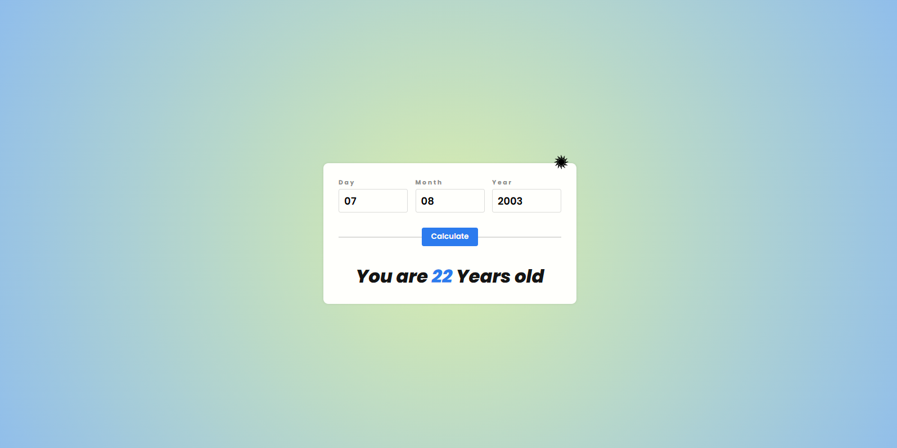
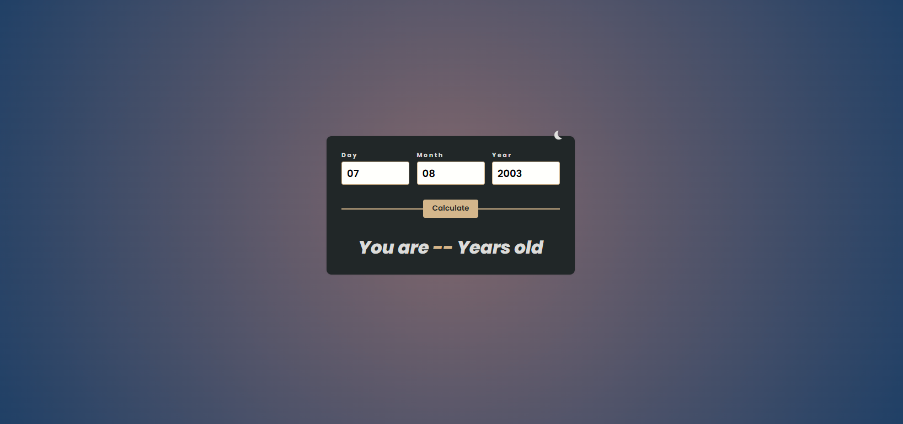

# Age-Calculator
Interactive age calculator built with HTML, CSS, and JavaScript — quickly calculate your age from your birthdate
Includes keyboard accessibility, basic error handling, dark mode, and a responsive design.

---

## 🚀 Live Preview

🔗 [View Live Site](https://gamalhafez.github.io/Age-Calculator/)

---

## 🌗 Screenshots

### Normal Mode

### Dark Mode

---

## 🚀 Features

- ✔️ Calculate exact age from a given birthdate
- ✔️ Handles invalid inputs gracefully (empty fields, invalid dates, future dates)
- ✔️ Full keyboard accessibility (tab navigation, Enter triggers button)
- ✔️ Toggle between light & dark mode
- ✔️ Responsive layout for mobile & desktop

---

### 🛠️ Tech Stack

- HTML5 for structure
- CSS3 (with dark mode + responsive design)
- JavaScript for logic & interactions
